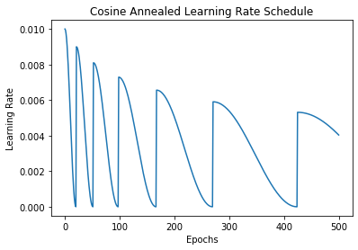

[](https://github.com/adamvvu/snapshot_ensemble/actions/workflows/snapshot_ensemble_tests.yml)
[](https://pypi.org/project/snapshot_ensemble/)
[](https://pypi.org/project/snapshot_ensemble/)
[](https://github.com/adamvvu/snapshot_ensemble/blob/master/LICENSE)

Train TensorFlow Keras models with cosine annealing and save an ensemble of models with no additional computational expense.

------------------------------------------------------------------------

## **snapshot_ensemble**

Ensembles of machine learning models have empirically demonstrated
state-of-the-art results in many regression and classification tasks.
Deep neural networks are popular models given their flexibility and
theoretical properties, but ensembling several independent neural networks 
is often impractical due to the computational expense.

Huang et al. (2017) proposes the simple idea of *Snapshot Ensembling*, where
a single neural network is trained via cyclic learning rate schedules such as
cosine annealing (Loshchilov and Hutter, 2017). At the end of each annealing cycle,
the model parameters are saved and thus we obtain an ensemble of trained neural
networks at the cost of training a single one.

Conceptually, we may think of this as letting the neural network quickly converge 
by using a decaying learning rate, and then saving the model at several 
local minima of the loss surface. We may then used the saved models as part of
an ensemble for prediction or inference.

This simple library is an implementation of their ideas as a TensorFlow 2 Keras Callback
to be used during training.

[Documentation](https://adamvvu.github.io/snapshot_ensemble/docs/)

## Getting Started

### Installation

`pip install snapshot_ensemble`

#### Dependencies:

    # Required
    python >= 3.6
    numpy
    tensorflow >= 2.0

    # Suggested
    matplotlib

### Usage

``` python
from snapshot_ensemble import SnapshotEnsembleCallback

model = # Compiled TensorFlow 2 Keras model

# Train the Keras model with Cosine Annealing + Snapshot Ensembling
snapshotCB = SnapshotEnsembleCallback()
model.fit(*args,
          callbacks = [ snapshotCB ]
        )

# Snapshotted models are then automatically saved (default: `Ensemble/`)
# and may be loaded in for ensembled predictions or inference
```

### Dynamic Learning Rate Schedule

The learning rate schedule inside `SnapshotEnsembleCallback` takes the following parameters:  
    -`cycle_length` : Initial number of epochs per cycle  
    -`cycle_length_multiplier` : Multiplier on number of epochs per cycle  
    -`lr_init` : Initial maximum learning rate  
    -`lr_min` : Initial minimum learning rate  
    -`lr_multiplier` : Multiplier on learning rate per cycle  

The `cycle_length`, `lr_init`, and `lr_min` parameters control the initial length and learning rate bounds of each cycle. 
The `*_multiplier` parameters allow for dynamically adjusting the length and/or learning rate bounds as training
progresses. It is very likely that the default parameters are suboptimal for your task, so these hyperparameters
will need to be tuned. There is a helper function `VisualizeLR()` to visualize the learning rate schedule.

<p align="middle">
    
    
    
</p>

<p style="text-align: center;">
    <em>
    (Left) Standard Cosine Annealing (Middle) Dynamic length (Right) Dynamic length and learning rate bounds
    </em>
</p>

### Example

For a simple example, see this
[notebook](https://adamvvu.github.io/snapshot_ensemble/examples/Example.html).

## References

Huang, G., Li, Y., & Pleiss, G. (2017). Snapshot Ensembles: Train 1, Get M for Free. 
   International Conference on Learning Representations. https://doi.org/https://doi.org/10.48550/arXiv.1704.00109

Loshchilov, I., & Hutter, F. (2017). SGDR: Stochastic Gradient Descent with Warm Restarts. 
    International Conference on Learning Representations. https://doi.org/https://doi.org/10.48550/arXiv.1608.03983
